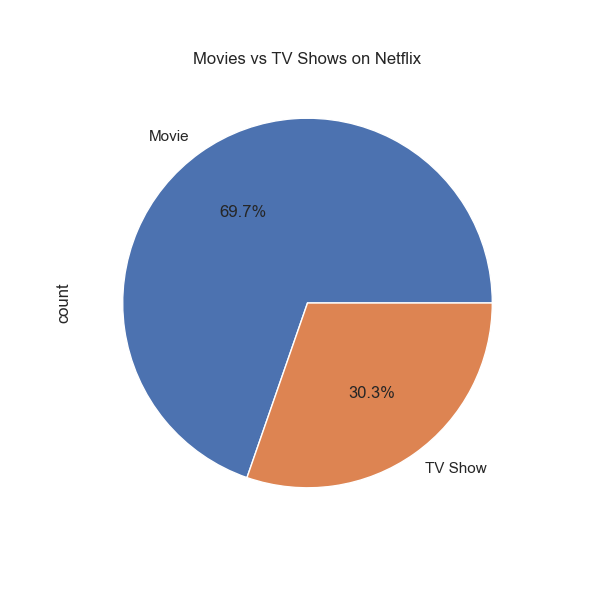
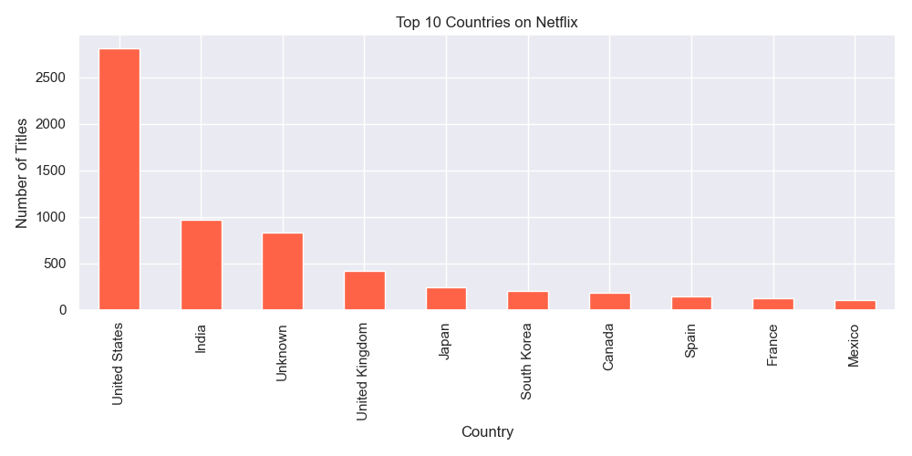
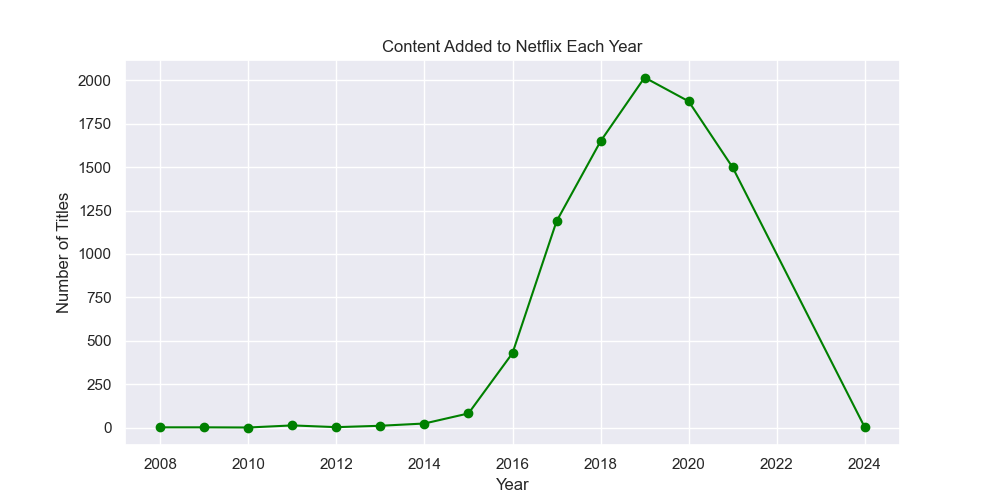
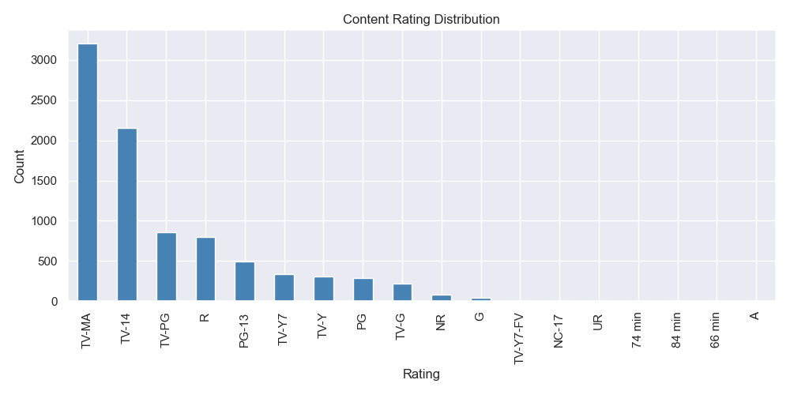
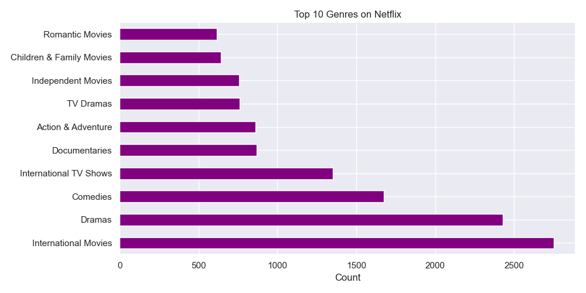
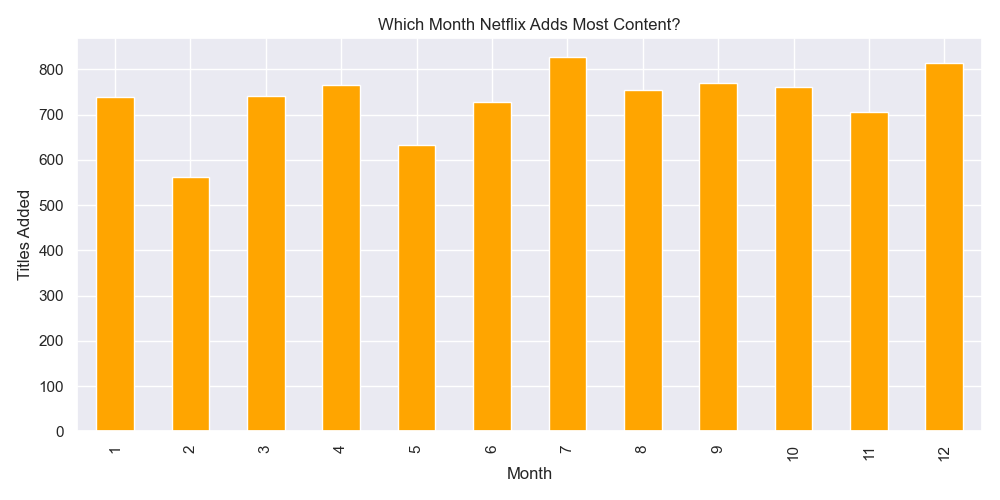

<div align="center">

# 🎬 Netflix Content Analysis

### Exploratory Data Analysis using Python


</div>

---

## 📌 Project Overview

Netflix has over **8,000+ titles** across 190+ countries.
This project digs into that data to uncover **what content dominates,
which countries produce the most, and how Netflix has grown year by year.**

> 💼 This kind of analysis helps **OTT platforms, media agencies,
> and content startups** make smarter decisions about what to produce and when.

---

## 🎯 Business Questions Answered

| # | Question |
|---|----------|
| 1 | What is the ratio of Movies vs TV Shows? |
| 2 | Which countries produce the most content? |
| 3 | How has Netflix grown year over year? |
| 4 | What are the most common content ratings? |
| 5 | Which genres dominate the platform? |
| 6 | Which month does Netflix release the most content? |

---

## 📊 Key Insights

- 🎥 **70% Movies, 30% TV Shows** — Movies dominate the platform
- 🌍 **USA, India & UK** are the top 3 content-producing countries
- 📈 **2018–2020** saw Netflix's biggest content explosion
- 🔞 **TV-MA is the #1 rating** — adult content leads
- 🎭 **Dramas & Comedies** are the most listed genres
- 📅 **January & July** are peak months for new content drops

---

## 📸 Visualizations

### 🎬 Movies vs TV Shows


### 🌍 Top 10 Countries


### 📈 Content Added Per Year


### ⭐ Rating Distribution


### 🎭 Top 10 Genres


### 📅 Best Month for Content


---

## 🛠️ Tools & Technologies

| Tool | Purpose |
|------|---------|
| Python 3.10 | Core programming |
| Pandas | Data cleaning & analysis |
| Matplotlib | Chart creation |
| Seaborn | Styled visualizations |
| VS Code | Development environment |
| Jupyter Notebook | Interactive analysis |

---

## 📂 Dataset

- **Source:** [Kaggle — Netflix Movies and TV Shows](https://www.kaggle.com/datasets/shivamb/netflix-shows)
- **Size:** 8,807 rows × 12 columns
- **Fields:** Title, Type, Director, Cast, Country, Date Added, Rating, Genre

---

## ▶️ How to Run This Project

```bash
# 1. Clone the repo
git clone https://github.com/YOURUSERNAME/netflix-eda.git

# 2. Go into the folder
cd netflix-eda

# 3. Install libraries
pip install pandas matplotlib seaborn notebook

# 4. Open the notebook
jupyter notebook netflix_analysis.ipynb
```

---

## 👤 About Me

**[YOUR NAME]** — Data Analyst | Python • Pandas • EDA

I help businesses make sense of their data through
clean analysis and clear visual storytelling.

📬 Open for **freelance projects**

[](YOUR_LINKEDIN_URL)
[](mailto:YOUR@EMAIL.COM)

---

<div align="center">

⭐ **If you found this useful, give it a star!** ⭐

</div>